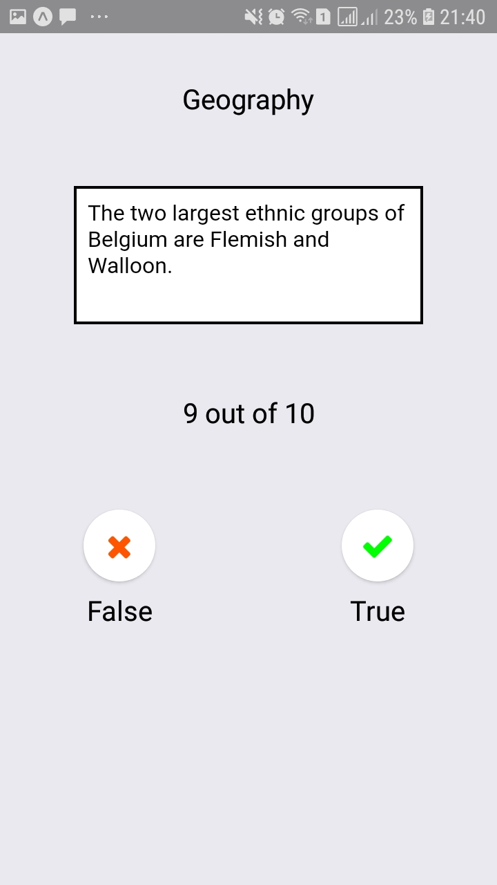
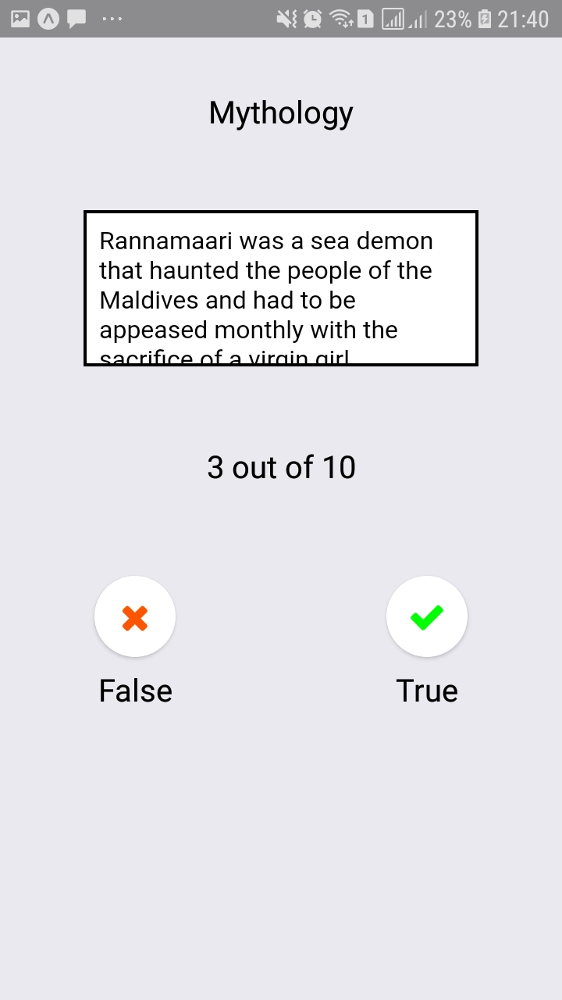
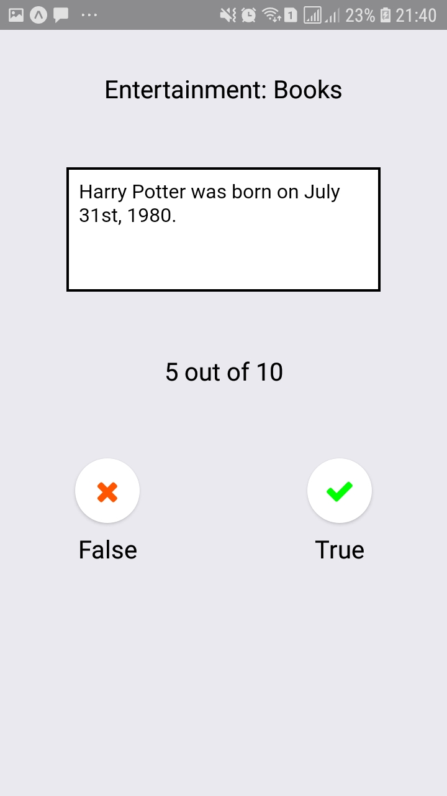

### `yarn start`

Runs your app in development mode.

Open it in the [Expo app](https://expo.io) on your phone to view it. It will reload if you save edits to your files, and you will see build errors and logs in the terminal.

```
npm start
# or
yarn start
```

#### `yarn test`

Runs the [jest](https://github.com/facebook/jest) test runner on your tests.

#### `Screenshots`

#### Home


#### Quiz


#### Quiz


#### Quiz


#### Result
